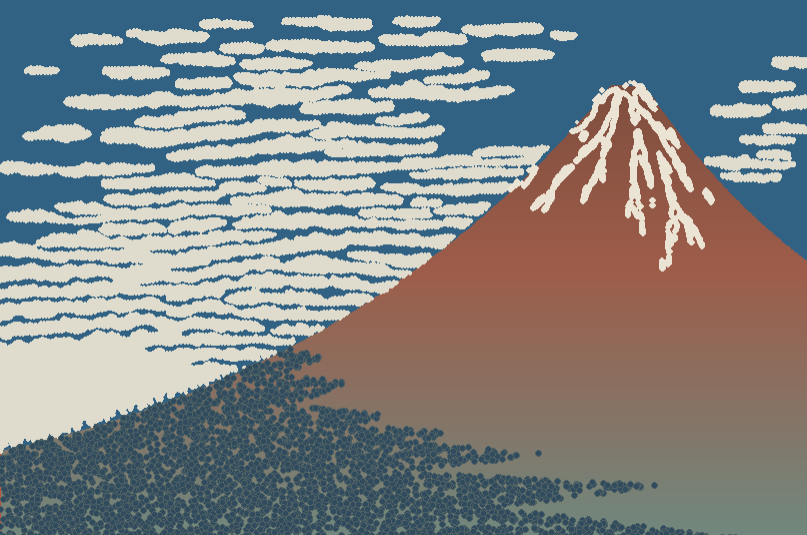
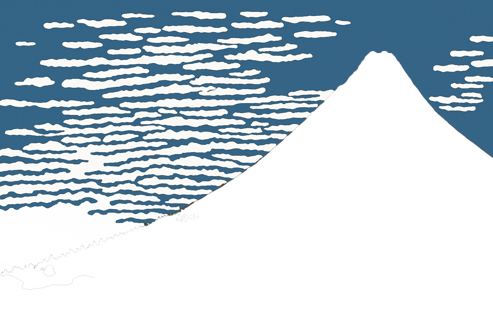

# Art Recreation using R and ggplot2

This project explores the intersection of art and data visualization by recreating the iconic "Red Fuji" by Hokusai using R.

## Motivation

This project allows me to expand my technical skills in R while exploring artistic expression. I am especially interested in how R's plotting ecosystem (e.g., `ggplot2`, `grid`) can be used not only for data communication but also for creative visual storytelling.

While there are existing efforts in the R community to produce generative art, my focus is on **manually recreating an iconic artwork**, using custom R code to explore techniques like layering, coordinate manipulation, and geometric composition.

## Technical Approach

The recreation focuses on "Red Fuji" by Hokusai. The technical approach involves:

*   **Packages**: Utilizing R packages such as `ggplot2`, `magick` and `grid`.
*   **Techniques**: Employing layered plotting, coordinate manipulation, and path construction.
*   **Data Extraction**: A key technique for visually discrete figures like trees, clouds, and snow involves converting points from the original image into data points using Python scripts. These extracted data points (`data/*.csv`) are then used within the R code to represent these elements.

## Result

The final recreated artwork can be seen here, alongside the original image and visualizations of the extracted data points:

## Files

- `Red Fuji.Rmd`: The R Markdown file containing the R code for the art recreation.
- `extract_cloud_data.py`: Python script to extract cloud data points from an image.
- `extract_snow_data.py`: Python script to extract snow data points from an image.
- `extract_tree_data.py`: Python script to extract tree data points from an image.
- `data/`: Folder containing the extracted CSV data files (`cloud.csv`, `snow.csv`, `trees.csv`).
- `images/`: Folder containing the image files used and generated by the project.
